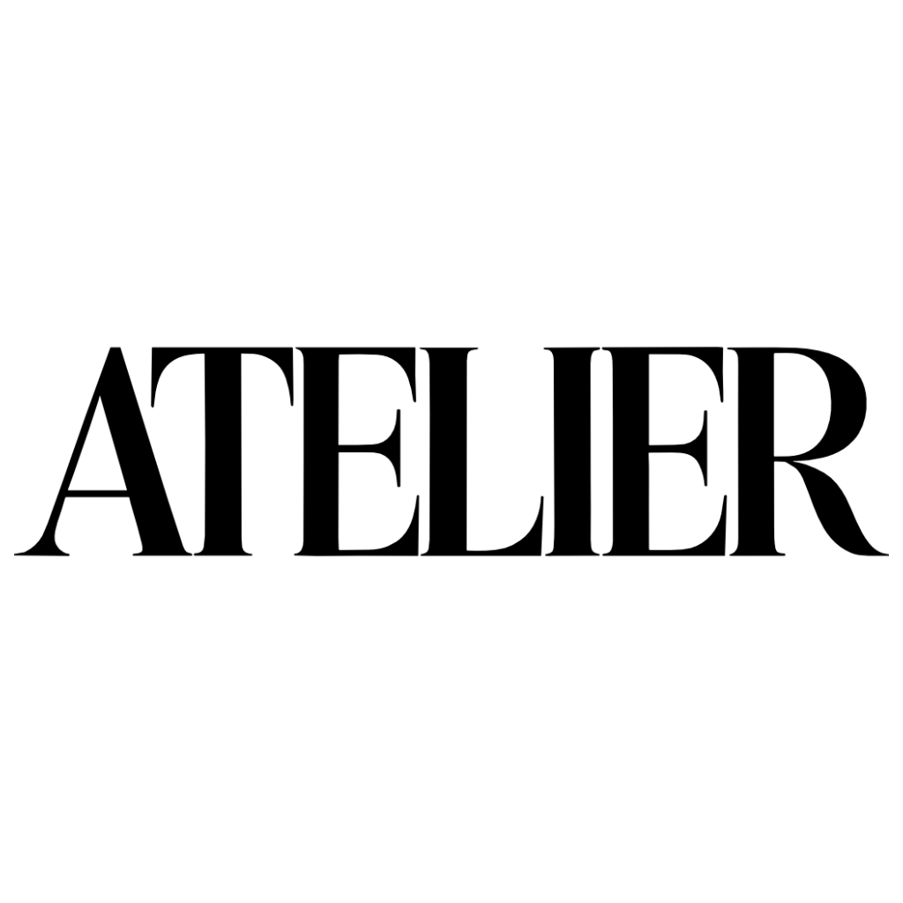

  
  <h1>gen media editor</h1>

- **node graph editor**: visual workflow builder with ReactFlow
- **provider-agnostic**: supports any AI SDK provider (Runpod currently)
- **media manager**: unified asset storage and management
- **workflow engine**: topological execution with queue management
- **secure credentials**: provider API keys stored in WorkOS Vault

## documentation

see [`docs/context.md`](docs/context.md) for detailed architecture, conventions, and development guidelines.

## contributing

see [`CONTRIBUTING.md`](CONTRIBUTING.md) for contribution guidelines.
